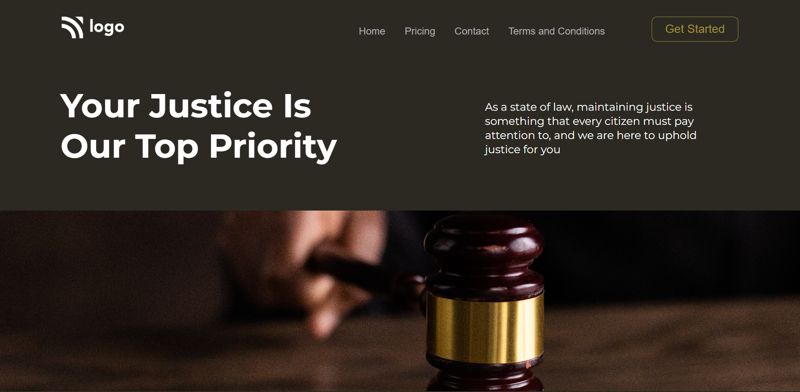

# Law Home Page

## Project 03 🚀 Website's Live [Link](https://law-web-page.netlify.app/)🔗

>by Arpit Pathak

Screenshot

## What I learned from this Project? 

- Learned to use CSS position (Absolute & Relative) property.
- Learned to add and place images inside a div.
- Learned to use :hover selector

## Time taken to finish this project ⏳
- 1.5 hours
---

